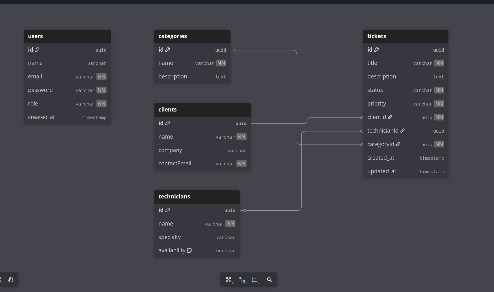

<p align="center">
  
</p>

<h1 align="center"> 🎫 Support Ticket System API </h1>

Technological solution for managing users and tracking technical support incidents, built with NestJS.

## Description

This is a **Backend API** built with **NestJS** and **TypeORM** that provides a complete system for a support help desk.

The application includes robust **JWT Authentication** and **Role-Based Authorization** to secure endpoints, along with a full **CRUD** (Create, Read, Update, Delete) module for tracking support **Tickets** from creation to closure.

### Module Features

### 1. 🔑 Authentication & Authorization Module
* **JWT Flow:** Secure user registration and login to generate JSON Web Tokens.
* **Role-Based Access:** Uses a **Custom `RolesGuard`** to restrict access based on the user's role.
* **User Management Endpoints:** **Admin-only** access to perform full CRUD operations on all users (`/api/users`).

### 2. 👥 User Roles
* **`Administrator`:** Full access, manages users and system configuration.
* **`Technician`:** (Future use) Assigned tickets, handles resolution.
* **`Client`:** Creates and views their own support tickets.

### 3. 🎫 Support Ticket Module
* **CRUD Operations:** Full management of support tickets (`/api/tickets`).
* **Status Control:** Tickets use defined statuses: **`Open`**, **`In Progress`**, **`Resolved`**, and **`Closed`**.
* **Assignment:** Specific endpoints to assign tickets to a **Technician**.
* **Categorization:** Tickets are linked to specific service **Categories** (e.g., Hardware, Software).
* **Relations:** Tickets are linked to the **Client** (creator) and the **Technician** (assigned resolver).

### General Features
* **RESTful API:** Well-structured endpoints for all resources.
* **API Documentation:** Uses **Swagger UI** for easy testing and endpoint visualization.
* **Database Management:** Uses **TypeORM** for seamless interaction with PostgreSQL.

---

## 💻 Technologies Used

* NestJS
* TypeScript (TS)
* TypeORM (for database ORM)
* PostgreSQL (Database)
* Passport & JWT (Authentication)
* Swagger (API Documentation)
* `bcrypt` (Password hashing)
* `dotenv` (for environment configuration)

---

## 👤 Author

Developed by:
- **Joel Restrepo** ([@JoelR19](https://github.com/JoelR19))

---

## 📥 Installation

Follow these steps to set up the project locally:

1.  **Clone the repository:**
    ```bash
    git clone [https://github.com/JoelR19/YOUR_PROJECT_NAME.git](https://github.com/JoelR19/YOUR_PROJECT_NAME.git)
    cd YOUR_PROJECT_NAME
    ```
2.  **Install dependencies:**
    ```bash
    npm install
    ```
3.  **Set up environment variables:**

    Create a `.env` file in the root directory.

    #### Environment Variables
    You will need to add the following environment variables (minimum required):

    `DATABASE_URL` or individual variables (`DB_HOST`, `DB_USER`, `DB_PASSWORD`, etc.)
    `JWT_SECRET` (e.g., A long random string)
    `JWT_EXPIRATION_TIME` (e.g., 3600s or 1h)

4.  **Database Synchronization:**
    * Ensure your database is running and configured correctly in TypeORM.

---

## Running the Project

Start the server in development mode:
**npm run start:dev**
## Application Preview (Endpoints)

| Function | Method | Endpoint | Authorization |
| :--- | :--- | :--- | :--- |
| **Login** | `POST` | `/api/auth/login` | Public |
| **Register** | `POST` | `/api/auth/register` | Public |
| **List Users** | `GET` | `/api/users` | **Required: Admin Token** |
| **Create Ticket** | `POST` | `/api/tickets` | Public (for current testing) |
| **Get All Tickets**| `GET` | `/api/tickets` | Public (for current testing) |
| **Assign Technician**| `PATCH` | `/api/tickets/:id/assign` | Public (for current testing) |

---

<p align="center">
  
</p>

## License

This project is licensed under the MIT license. You are free to use, modify, and distribute it.
[MIT](https://choosealicense.com/licenses/mit/)